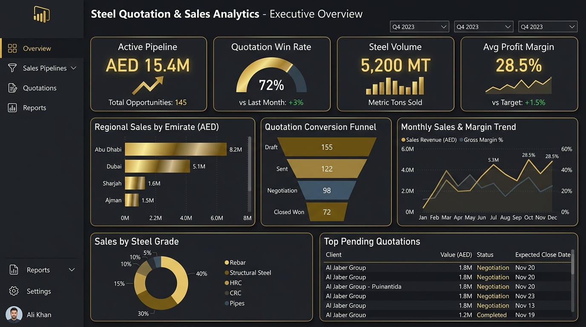

<div align="center">

  # 📊 Karthick Raja
  ### **Data Analyst & Power BI Developer**

  *Transforming Complex Datasets into Interactive Dashboards & Actionable Business Insights*

  📍 **Dubai, UAE** | 🎓 **B.E. Computer Science Engineering**

  [](https://karthickraja.page/)
  [](https://www.linkedin.com/in/karthick-raja-l-7a5b3a26b/)
  [](https://github.com/KarthickRaja46)
  [](mailto:karthickraja232205@gmail.com)

  ---

  ### 🛠️ Tech Stack & Badges
  
  
  
  
  
  
  
  
  
  

</div>


---

## 👨‍💻 About Me

**Data Analyst & Power BI Developer** with 1.5+ years of experience in **SQL, Power BI, DAX, Power Query, Azure, Excel, and data modeling**. Experienced in building KPI dashboards, executive reports, and BI solutions across **sales, banking, and supply chain**. Tracked **AED 15M+ in commercial opportunities** and **reduced reporting turnaround time by 70%**. Based in **Dubai, UAE**, available immediately.

- 💼 **Current Status:** Open to Full-Time Data Analyst & Power BI Developer roles
- 🎯 **Core Strengths:** Power BI, DAX, Power Query, SQL (MySQL, PostgreSQL, SQL Server), Microsoft Azure, Python (Pandas, NumPy, EDA), Advanced Excel, ETL Workflows
- 🌐 **Live Portfolio:** [https://karthickraja.page](https://karthickraja.page)

---

## 📈 Key Highlights & Stats

| Metric | Detail |
| :--- | :--- |
| 💼 **Experience** | **1.5+ Years** Hands-on Data Analyst & Power BI Developer Experience |
| 📊 **Dashboards Built** | **9+** Interactive Multi-Page BI Dashboards |
| 🔍 **Data Analyzed** | **150,000+** Data Records Cleaned & Processed |
| 🚀 **Projects Completed** | **8+** End-to-End Analytics, ETL & Machine Learning Projects |
| 📜 **Certifications** | **6+** Industry Certifications (Microsoft Power BI, IBM, HackerRank, Besant Tech) |

---

## 🚀 Featured Projects

### 1. Steel Quotation & Sales Analytics Dashboard
> **Technologies:** Power BI, DAX, SQL, Power Query, Star Schema

Designed an executive-level 5-page Power BI dashboard providing commercial leadership visibility into **AED 15M+ in active opportunities** across UAE emirates, saving **12+ hours/week** in reporting overhead.



#### 🌟 Key Features & Business Value:
- **5-Page Commercial Architecture:** Executive KPI Summary, Quotation Funnel, Regional Demand, Win/Loss Analysis, and Margin Diagnostics.
- **Workflow Automation:** Replaced manual Excel compilations with automated Power Query ETL pipelines, cutting turnaround time by 70%.
- **Advanced DAX Metrics:** 30+ dynamic measures for quotation aging, YoY growth, conversion rates, and regional volume distributions.

🔗 **[Live Power BI Dashboard](https://app.powerbi.com/view?r=eyJrIjoiMWQxMzFjYTAtZjkxMi00YzViLTg2NTktMGI5Y2YzNWRkNDBkIiwidCI6IjNjYjM3ODQ0LTAxZGEtNGJlYS04MDEwLTBmYjFmNWExZWM0ZSJ9)** | 💻 **[GitHub Profile](https://github.com/KarthickRaja46)**

---

### 2. Business Performance & Customer Analytics Dashboard
> **Technologies:** Power BI, DAX, KPI Analytics, Star Schema

Analyzed **$2.3M in revenue** and **$286K in profit** across **9,994 orders**, identifying customer retention patterns, cohort metrics, and YTD performance trends.


#### 🌟 Key Features & Business Value:
- **Customer Segmentation & Cohorts:** Evaluates customer lifetime value (LTV), cohort retention patterns, and churn risk factors.
- **Advanced DAX Measures:** Dynamic measures for YoY growth, profit margins, and executive KPI benchmarking.
- **Interactive Drill-Through:** Multi-level slicers and tooltip cards enabling root-cause analysis for executive reporting.

🔗 **[Live Power BI Dashboard](https://app.powerbi.com/view?r=eyJrIjoiNjRlMTgyYmYtYjBjOC00ZGUzLTlmMjMtYzY3NTBiMDcyMGZiIiwidCI6IjNjYjM3ODQ0LTAxZGEtNGJlYS04MDEwLTBmYjFmNWExZWM0ZSJ9)** | 💻 **[GitHub Profile](https://github.com/KarthickRaja46)**

---

### 3. Banking Performance Dashboard
> **Technologies:** Power BI, SQL, Financial Analytics, Power Query

Analyzed **₹4.87B in transaction value** across **150,000+ records**, identifying high-failure transaction segments and risk factors with SQL validation and Power Query ETL.


#### 🌟 Key Features & Business Value:
- **Financial KPIs:** Real-time monitoring of transaction volumes, failure rates, loan defaults, and liquidity metrics.
- **Data Transformation & QA:** Used SQL CTEs, window functions, and Power Query to clean and validate 150K+ transactional records.
- **Risk Segmentation:** Dynamic views enabling deep dives into high-failure transaction segments and abnormal patterns.

🔗 **[Live Power BI Dashboard](https://app.powerbi.com/view?r=eyJrIjoiMjg1MTcwZjktZTViMy00OTU3LTgyMTctNGIzNTRhNWYwYWM1IiwidCI6IjNjYjM3ODQ0LTAxZGEtNGJlYS04MDEwLTBmYjFmNWExZWM0ZSJ9)** | 💻 **[GitHub Profile](https://github.com/KarthickRaja46)**

---

### 4. VOLT IQ – Industrial IoT Machine Intelligence Platform
> **Technologies:** Power BI, IoT Analytics, Predictive Maintenance, Anomaly Detection

Analyzed **50,000+ IoT telemetry records** across industrial machines to monitor machine health, identify downtime risk, and detect vibration anomalies.


#### 🌟 Key Features & Business Value:
- **Equipment Health Monitoring:** Real-time tracking of vibration, temperature, and operating pressure telemetry.
- **Downtime Risk Identification:** Early indicator alerts to identify machine downtime risk before failure occurs.
- **Operational Efficiency:** Machine utilization benchmarks, MTBF indicators, and maintenance scheduling views.

🔗 **[Live Power BI Dashboard](https://app.powerbi.com/view?r=eyJrIjoiZTNjNzZiNGItYjM3Zi00NDNjLWFhODMtNjNiZjlkMWI4NjQ4IiwidCI6IjNjYjM3ODQ0LTAxZGEtNGJlYS04MDEwLTBmYjFmNWExZWM0ZSJ9&pageName=fd208009e45a735db3b9)** | 💻 **[GitHub Profile](https://github.com/KarthickRaja46)**

---

### Additional projects

The portfolio website highlights the three strongest Power BI projects. Other work includes VOLT IQ industrial IoT analytics, retail analytics, API performance monitoring, an audio classification app, and an ATS resume analyzer.

See the [GitHub profile](https://github.com/KarthickRaja46) and [LinkedIn projects](https://www.linkedin.com/in/karthick-raja-l-7a5b3a26b/) for the broader project history.

## 🛠️ Skills Matrix

| Category | Skills & Tools |
| :--- | :--- |
| **Business Intelligence** | Power BI, DAX, Power Query, Data Visualization, Dashboard Design, KPI Reporting |
| **Cloud & Data Platforms** | Microsoft Azure, Power BI Service |
| **Data Modeling & DAX** | Star Schema, Snowflake Schema, Complex DAX Measures, Time Intelligence |
| **Databases & Querying** | SQL, MySQL, PostgreSQL, SQL Server, Joins, Aggregations, Window Functions |
| **Programming & Data Science**| Python, Pandas, NumPy, Matplotlib, Seaborn, Machine Learning, TensorFlow |
| **ETL & Data Wrangling** | Power Query, Data Pipeline Design, Data Cleaning, Automated Refreshes |
| **Spreadsheets** | Advanced Excel, Pivot Tables, Power Pivot, VLOOKUP / XLOOKUP, Data Analysis |
| **Version Control & Tools** | Git, GitHub, VS Code, Jupyter Notebook |

---

## 📜 Professional Certifications

- 🏆 **Microsoft Certified: Power BI Data Analyst** — Microsoft *(Credential ID: TYPPUPQXZ0T8)*
- 🏆 **Data Analyst Certification** — Besant Technologies
- 🏆 **Career Essentials in Data Analysis** — Microsoft & LinkedIn
- 🏆 **Generative AI for Data Analysts** — IBM *(Credential ID: Q5AF9GPDM2LU)*
- 🏆 **Harnessing the Power of Data with Power BI** — Microsoft *(Credential ID: FHTK7PQTG40Z)*
- 🏆 **SQL (Intermediate)** — HackerRank

---

## 💼 Experience & Education

### **Experience**

**Data Analyst Intern**  
*Besant Technologies — Chennai, India* | **Jan 2026 – Jul 2026**
- Built end-to-end BI reporting solutions across Retail, Banking, and Supply Chain datasets, covering data extraction, cleansing, validation, analysis, and Power BI reporting.
- Used SQL with CTEs, joins, window functions, and aggregations to clean, validate, and standardize 500K+ transactional records, improving data accuracy and consistency across reports.
- Reviewed reporting and data refresh workflows and configured scheduled automation through Power BI Gateway, reducing reporting delays by 35% and improving reporting turnaround.
- Conducted Exploratory Data Analysis (EDA) using SQL and Python (Pandas) to identify sales trends, customer churn indicators, and fulfillment bottlenecks, supporting data-driven decision-making.

**Power BI Developer (Freelance)**  
*Enjay Engineering Services — Dubai, UAE (Remote)* | **May 2025 – Nov 2025 (7 Months)**
- Designed and maintained Power BI dashboards delivering executive and project-level KPI reporting for engineering quotation and commercial pipeline performance, giving regional leadership visibility into AED 15M+ in active opportunities across UAE emirates.
- Built Star Schema data models and 30+ DAX measures covering time intelligence, YoY growth, conversion rates, and quotation aging to support engineering project performance reporting and management reviews.
- Automated the weekly quotation reporting workflow using Power Query, eliminating 12+ hours of manual reporting effort per week and improving reporting efficiency.
- Analyzed regional product demand, steel grades, volumes, pricing, and margins to identify trends and margin leakage, providing actionable insights for prioritizing high-value commercial opportunities.
- Implemented Row-Level Security (RLS) to provide role-specific branch-level access for regional sales managers, strengthening data security and reporting governance.

### **Education**
**Bachelor of Engineering (B.E.) — Computer Science Engineering (CSE)**  
*Hindusthan Institute of Technology, Coimbatore* | **2022 – 2026** *(CGPA: 7.2)*

---

## 💻 Local Setup

To run this portfolio website locally on your computer:

```bash
# 1. Clone this repository
git clone https://github.com/KarthickRaja46/Portfolio-KarthickRaja.git

# 2. Navigate to the project directory
cd Portfolio-KarthickRaja

# 3. Open index.html in your web browser (or use VS Code Live Server extension)
```

---

## 📬 Contact & Connect

[](https://karthickraja.page/)
[](https://www.linkedin.com/in/karthick-raja-l-7a5b3a26b/)
[](https://github.com/KarthickRaja46)
[](mailto:karthickraja232205@gmail.com)

- 🌐 **Portfolio Website:** [https://karthickraja.page](https://karthickraja.page)
- 💼 **LinkedIn:** [Karthick Raja](https://www.linkedin.com/in/karthick-raja-l-7a5b3a26b/)
- 🐙 **GitHub:** [KarthickRaja46](https://github.com/KarthickRaja46)
- ✉️ **Email:** [karthickraja232205@gmail.com](mailto:karthickraja232205@gmail.com)
- 📍 **Location:** Dubai, United Arab Emirates

<div align="center">
  <br/>
  <i>© 2026 Karthick Raja. Built with passion for data analytics and business intelligence.</i>
</div>