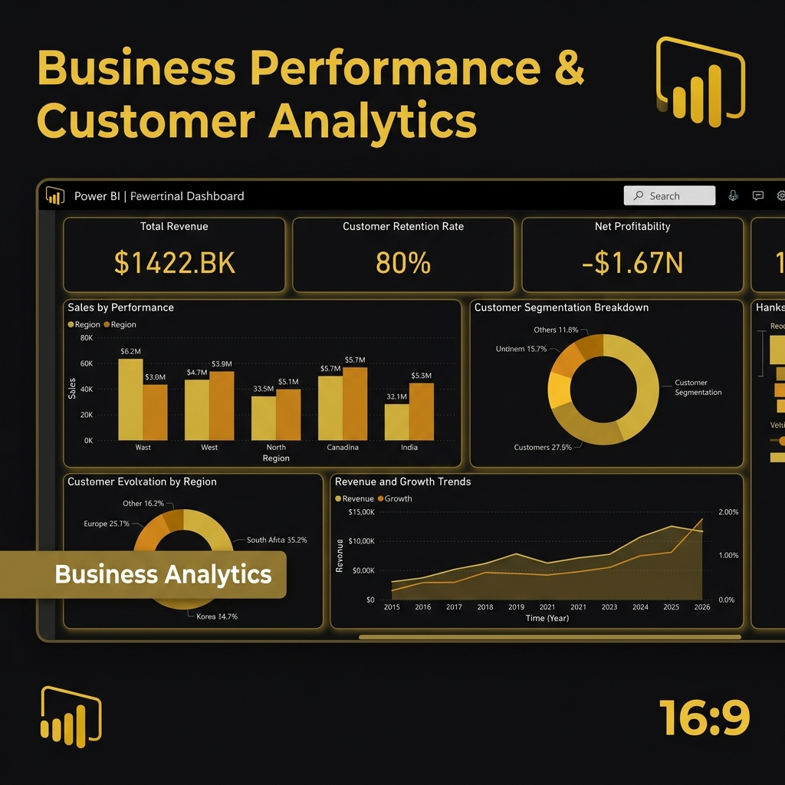
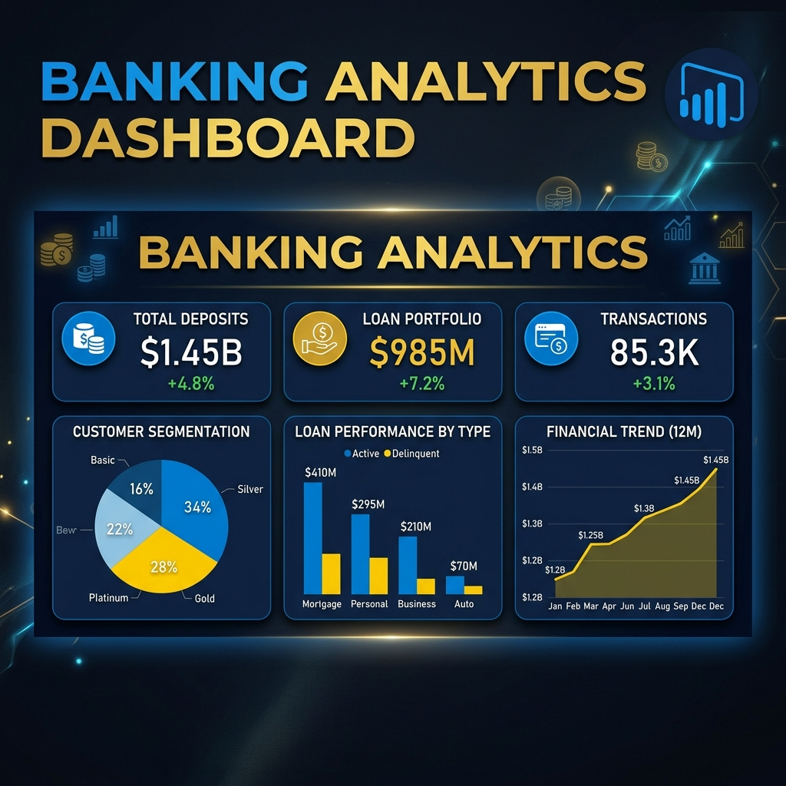
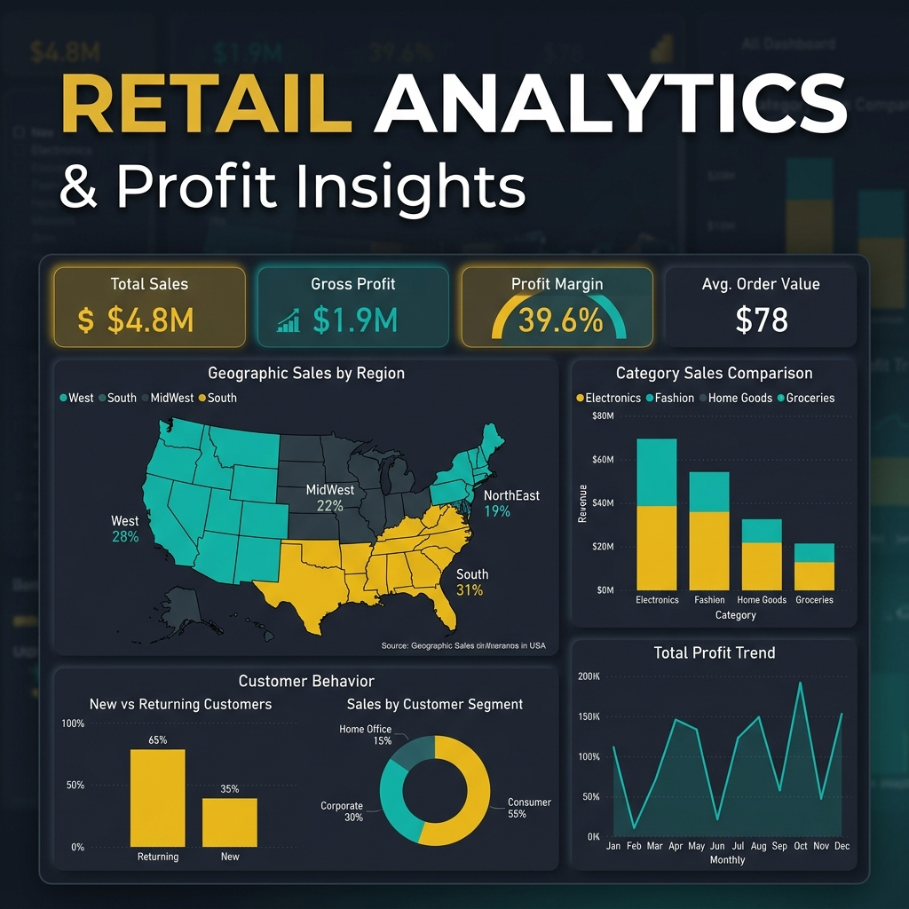
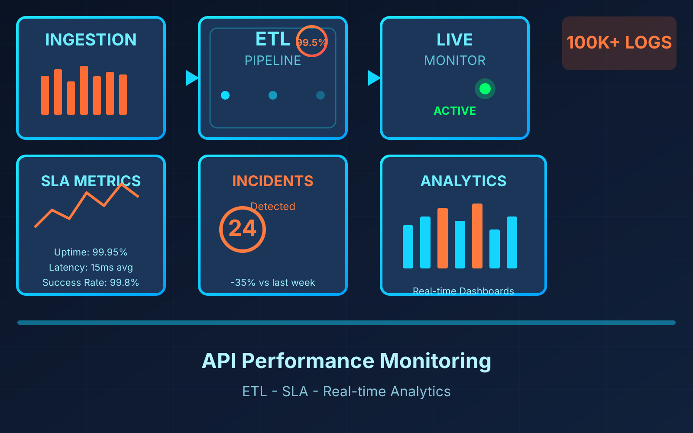
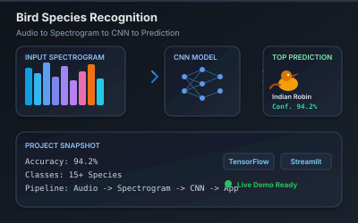
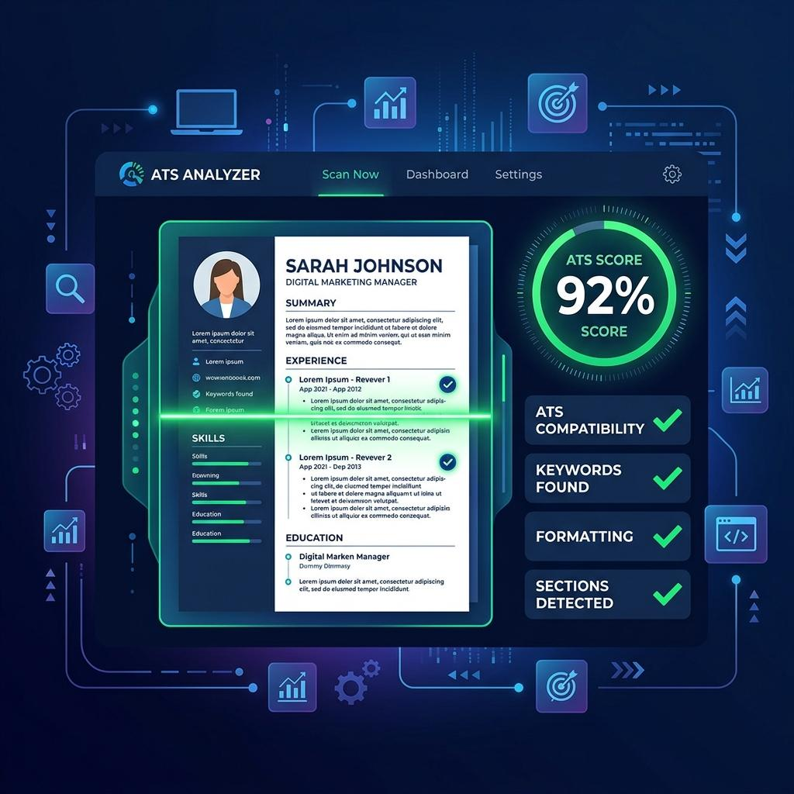

<div align="center">

  # 📊 Karthick Raja
  ### **Data Analyst & Power BI Developer**

  *Transforming Complex Datasets into Interactive Dashboards & Actionable Business Insights*

  📍 **Chennai, Tamil Nadu, India** | 🎓 **B.E. Computer Science Engineering**

  [](https://karthickraja.page/)
  [](https://www.linkedin.com/in/karthick-raja-l-7a5b3a26b/)
  [](https://github.com/KarthickRaja46)
  [](mailto:karthiikarthii46@gmail.com)

  ---

  ### 🛠️ Tech Stack & Badges
  
  
  
  
  
  
  
  
  
  

</div>


---

## 👨‍💻 About Me

**Data Analyst & Power BI Developer** with 1.5+ years of experience in **SQL, Power BI, DAX, Power Query, Azure, Excel, and data modeling**. Experienced in building KPI dashboards, executive reports, and BI solutions across **sales, banking, and supply chain**. Tracked **AED 15M+ in commercial opportunities** and **reduced reporting turnaround time by 70%**. Based in **Dubai, UAE**, available immediately.

- 💼 **Current Status:** Open to Full-Time Data Analyst & Power BI Developer roles
- 🎯 **Core Strengths:** Power BI, DAX, Power Query, SQL (MySQL, PostgreSQL, SQL Server), Microsoft Azure, Python (Pandas, NumPy, EDA), Advanced Excel, ETL Workflows
- 🌐 **Live Portfolio:** [https://karthickraja.page](https://karthickraja.page)

---

## 📈 Key Highlights & Stats

| Metric | Detail |
| :--- | :--- |
| 💼 **Experience** | **1.5+ Years** Hands-on Data Analyst & Power BI Developer Experience |
| 📊 **Dashboards Built** | **9+** Interactive Multi-Page BI Dashboards |
| 🔍 **Data Analyzed** | **150,000+** Data Records Cleaned & Processed |
| 🚀 **Projects Completed** | **8+** End-to-End Analytics, ETL & Machine Learning Projects |
| 📜 **Certifications** | **6+** Industry Certifications (Microsoft Power BI, IBM, HackerRank, Besant Tech) |

---

## 🚀 Featured Projects

### 1. ClaimVision – Healthcare Claims Intelligence Dashboard
> **Technologies:** Power BI, DAX, Power Query, Healthcare Analytics, Data Modeling

An executive-ready Power BI dashboard providing healthcare organizations with a 360° view of claims data — analyzing **20,000+ claims** and **₹25Bn+ claim amount** with a **24.9% fraud detection rate**.



#### 🌟 Key Features & Business Value:
- **6-Page Architecture:** Patient Demographics, Provider Risk Scoring, Claims Trends, Fraud Pattern Analysis, and Executive Summary.
- **Provider Risk Scoring:** Automated risk profiling to flag anomalous claims and reduce financial loss.
- **Data Modeling:** Built on a star-schema model with advanced DAX measures and Power Query ETL transformations.

🔗 **[Live Power BI Dashboard](https://app.powerbi.com/view?r=eyJrIjoiMWQxMzFjYTAtZjkxMi00YzViLTg2NTktMGI5Y2YzNWRkNDBkIiwidCI6IjNjYjM3ODQ0LTAxZGEtNGJlYS04MDEwLTBmYjFmNWExZWM0ZSJ9)** | 💻 **[GitHub Repository](https://github.com/KarthickRaja46)**

---

### 2. Business Performance & Customer Intelligence Dashboard
> **Technologies:** Power BI, DAX, KPI Analytics, Customer Intelligence

An interactive Power BI dashboard tracking corporate performance, revenue growth, customer acquisition costs, churn rates, and profitability KPIs.


#### 🌟 Key Features & Business Value:
- **Customer Segmentation:** Analyzes customer lifetime value (LTV), cohort retention, and churn indicators.
- **Advanced DAX Measures:** Implemented dynamic measures for YoY growth, profit margins, and KPI tracking.
- **Interactive UI:** Dynamic slicers, drill-through pages, and visual tooltips for executive reporting.

🔗 **[Live Power BI Dashboard](https://app.powerbi.com/view?r=eyJrIjoiNjRlMTgyYmYtYjBjOC00ZGUzLTlmMjMtYzY3NTBiMDcyMGZiIiwidCI6IjNjYjM3ODQ0LTAxZGEtNGJlYS04MDEwLTBmYjFmNWExZWM0ZSJ9)** | 💻 **[GitHub Repository](https://github.com/KarthickRaja46/Business-Performance-Customer-Intelligence-Dashboard.git)**

---

### 3. Banking Analytics Dashboard
> **Technologies:** Power BI, Power Query, DAX, Financial Analytics

Designed for financial analysts, this dashboard evaluates loan portfolio health, customer deposit distributions, and transaction trends across banking segments.



#### 🌟 Key Features & Business Value:
- **Financial KPIs:** Real-time tracking of deposits, loan defaults, non-performing assets (NPAs), and interest margins.
- **Power Query ETL:** Multi-source data cleaning, transformation, and star-schema optimization.
- **Interactive Drill-Down:** Dynamic views enabling deep dives into high-risk borrower accounts.

🔗 **[Live Power BI Dashboard](https://app.powerbi.com/view?r=eyJrIjoiMjg1MTcwZjktZTViMy00OTU3LTgyMTctNGIzNTRhNWYwYWM1IiwidCI6IjNjYjM3ODQ0LTAxZGEtNGJlYS04MDEwLTBmYjFmNWExZWM0ZSJ9)** | 📄 **[PDF Report](assets/Banking%20Performance.pdf)** | 💻 **[GitHub Repository](https://github.com/KarthickRaja46/Banking-Performance.git)**

---

### 4. VOLT IQ – Industrial IoT Machine Intelligence Dashboard
> **Technologies:** Power BI, IoT Analytics, Predictive Maintenance, Anomaly Detection

Analyzed **50,000+ IoT sensor telemetry records** across industrial machines to monitor machine health, track downtime, and detect anomalies.


#### 🌟 Key Features & Business Value:
- **Predictive Maintenance:** Early warning indicators to minimize unplanned equipment downtime.
- **Telemetry Anomaly Detection:** Flags unexpected temperature, vibration, and pressure spikes.
- **Operational KPIs:** Machine efficiency scores, mean time between failures (MTBF), and uptime tracking.

🔗 **[Live Power BI Dashboard](https://app.powerbi.com/view?r=eyJrIjoiZTNjNzZiNGItYjM3Zi00NDNjLWFhODMtNjNiZjlkMWI4NjQ4IiwidCI6IjNjYjM3ODQ0LTAxZGEtNGJlYS04MDEwLTBmYjFmNWExZWM0ZSJ9&pageName=fd208009e45a735db3b9)** | 📄 **[PDF Report](assets/VOLT%20IQ%20-%20IoT%20Machine%20Intelligence%20Platform.pdf)** | 💻 **[GitHub Repository](https://github.com/KarthickRaja46/VOLT-IQ-IoT-Machine-Intelligence-Platform.git)**

---

### 5. Retail Analytics & Profit Insights Dashboard
> **Technologies:** Power BI, DAX, Time Intelligence, Sales Analytics

A commercial reporting dashboard evaluating store revenue streams, profit margins, regional growth, and product category performance.



#### 🌟 Key Features & Business Value:
- **Time Intelligence:** Implemented DAX logic for `YoY`, `MoM`, `YTD`, `MTD`, and rolling averages.
- **Geographic Mapping:** Visualized sales density and profit distribution across store regions.
- **Product Category Matrix:** High-margin item identification to guide inventory allocation.

🔗 **[Live Power BI Dashboard](https://app.powerbi.com/view?r=eyJrIjoiMjRmN2U0OTUtZTJmZi00ZjhhLTkxZmEtOGI3MzRmN2QxZTE3IiwidCI6IjNjYjM3ODQ0LTAxZGEtNGJlYS04MDEwLTBmYjFmNWExZWM0ZSJ9)** | 📄 **[PDF Report](assets/Retail%20Analytics%20%26%20Profit%20Insights.pdf)** | 💻 **[GitHub Repository](https://github.com/KarthickRaja46/Retail-Analytics-Profit-Insights.git)**

---

### 6. API Performance Monitoring & Analytics System
> **Technologies:** Python, SQL, ETL, Power BI, SLA Analytics

Built an automated end-to-end ETL pipeline processing **100,000+ API log records** with automated data validation and SLA latency monitoring.



#### 🌟 Key Features & Business Value:
- **99.5% Data Consistency:** Automated validation pipeline filtering corrupted logs.
- **SLA & Latency Tracking:** Real-time dashboards monitoring endpoint response times and status codes.
- **Incident Detection:** 30% faster incident detection with threshold-based alert views.

💻 **[GitHub Repository](https://github.com/KarthickRaja46/API-Performance-Monitoring-Analytics)**

---

### 7. AI Bird Species Recognition System
> **Technologies:** Python, TensorFlow, Audio Processing (MFCC), Streamlit

A deep learning audio classification model extracting MFCC features from bird sound recordings to predict bird species in real time.



#### 🌟 Key Features & Business Value:
- **MFCC Feature Extraction:** Converts raw audio signals into mel-frequency cepstral coefficients.
- **Streamlit Web App:** Deployed interactive UI allowing audio file uploads and instant prediction output.

🔗 **[Live Streamlit App](https://bird-species-identifier-ai-qi82svyxaieeiyo2jzr4wd.streamlit.app/)** | 💻 **[GitHub Repository](https://github.com/KarthickRaja46/Bird-species-audio-classifier)**

---

### 8. ATS Resume Analyzer
> **Technologies:** React, TypeScript, Node.js, Generative AI, Express

A full-stack application using LLMs to evaluate resume alignment with Data Analyst job descriptions, extract PDF text, and provide AI feedback.



#### 🌟 Key Features & Business Value:
- **ATS Keyword Matching:** Calculates compatibility scores and missing key skills.
- **AI Rewriting Engine:** Suggests bullet-point improvements tailored for BI & Data roles.

🔗 **[Live App Demo](https://ats-resume-analyzer-i3kr.onrender.com)** | 💻 **[GitHub Repository](https://github.com/KarthickRaja46/ATS-Resume-Analyzer.git)**

---

## 🛠️ Skills Matrix

| Category | Skills & Tools |
| :--- | :--- |
| **Business Intelligence** | Power BI, DAX, Power Query, Data Visualization, Dashboard Design, KPI Reporting |
| **Cloud & Data Platforms** | Microsoft Azure, Power BI Service |
| **Data Modeling & DAX** | Star Schema, Snowflake Schema, Complex DAX Measures, Time Intelligence |
| **Databases & Querying** | SQL, MySQL, PostgreSQL, SQL Server, Joins, Aggregations, Window Functions |
| **Programming & Data Science**| Python, Pandas, NumPy, Matplotlib, Seaborn, Machine Learning, TensorFlow |
| **ETL & Data Wrangling** | Power Query, Data Pipeline Design, Data Cleaning, Automated Refreshes |
| **Spreadsheets** | Advanced Excel, Pivot Tables, Power Pivot, VLOOKUP / XLOOKUP, Data Analysis |
| **Version Control & Tools** | Git, GitHub, VS Code, Jupyter Notebook |

---

## 📜 Professional Certifications

- 🏆 **Microsoft Certified: Power BI Data Analyst** — Microsoft *(Credential ID: TYPPUPQXZ0T8)*
- 🏆 **Data Analyst Certification** — Besant Technologies
- 🏆 **Career Essentials in Data Analysis** — Microsoft & LinkedIn
- 🏆 **Generative AI for Data Analysts** — IBM *(Credential ID: Q5AF9GPDM2LU)*
- 🏆 **Harnessing the Power of Data with Power BI** — Microsoft *(Credential ID: FHTK7PQTG40Z)*
- 🏆 **SQL (Intermediate)** — HackerRank

---

## 💼 Experience & Education

### **Experience**

**Data Analyst Intern**  
*Besant Technologies — Chennai, India* | **Jan 2026 – Jul 2026**
- Built end-to-end BI reporting solutions across Retail, Banking, and Supply Chain datasets, covering data extraction, cleansing, validation, analysis, and Power BI reporting.
- Used SQL with CTEs, joins, window functions, and aggregations to clean, validate, and standardize 500K+ transactional records, improving data accuracy and consistency across reports.
- Reviewed reporting and data refresh workflows and configured scheduled automation through Power BI Gateway, reducing reporting delays by 35% and improving reporting turnaround.
- Conducted Exploratory Data Analysis (EDA) using SQL and Python (Pandas) to identify sales trends, customer churn indicators, and fulfillment bottlenecks, supporting data-driven decision-making.

**Power BI Developer (Freelance)**  
*Enjay Engineering Services — Dubai, UAE (Remote)* | **May 2025 – Nov 2025 (7 Months)**
- Designed and maintained Power BI dashboards delivering executive and project-level KPI reporting for engineering quotation and commercial pipeline performance, giving regional leadership visibility into AED 15M+ in active opportunities across UAE emirates.
- Built Star Schema data models and 30+ DAX measures covering time intelligence, YoY growth, conversion rates, and quotation aging to support engineering project performance reporting and management reviews.
- Automated the weekly quotation reporting workflow using Power Query, eliminating 12+ hours of manual reporting effort per week and improving reporting efficiency.
- Analyzed regional product demand, steel grades, volumes, pricing, and margins to identify trends and margin leakage, providing actionable insights for prioritizing high-value commercial opportunities.
- Implemented Row-Level Security (RLS) to provide role-specific branch-level access for regional sales managers, strengthening data security and reporting governance.

### **Education**
**Bachelor of Engineering (B.E.) — Computer Science Engineering (CSE)**  
*Hindusthan Institute of Technology, Coimbatore* | **2022 – 2026** *(CGPA: 7.2)*

---

## 💻 Local Setup

To run this portfolio website locally on your computer:

```bash
# 1. Clone this repository
git clone https://github.com/KarthickRaja46/Portfolio-KarthickRaja.git

# 2. Navigate to the project directory
cd Portfolio-KarthickRaja

# 3. Open index.html in your web browser (or use VS Code Live Server extension)
```

---

## 📬 Contact & Connect

[](https://karthickraja.page/)
[](https://www.linkedin.com/in/karthick-raja-l-7a5b3a26b/)
[](https://github.com/KarthickRaja46)
[](mailto:karthiikarthii46@gmail.com)

- 🌐 **Portfolio Website:** [https://karthickraja.page](https://karthickraja.page)
- 💼 **LinkedIn:** [Karthick Raja](https://www.linkedin.com/in/karthick-raja-l-7a5b3a26b/)
- 🐙 **GitHub:** [KarthickRaja46](https://github.com/KarthickRaja46)
- ✉️ **Email:** [karthiikarthii46@gmail.com](mailto:karthiikarthii46@gmail.com)
- 📍 **Location:** Chennai, Tamil Nadu, India

<div align="center">
  <br/>
  <i>© 2026 Karthick Raja. Built with passion for data analytics and business intelligence.</i>
</div>